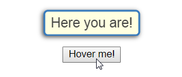

# eleganttip.css&nbsp;&nbsp;[](https://github.com/gw19/eleganttip.css/releases)&nbsp;[]()
Provide an elegant and configurable tips message block (tooltips) on your DOM element while mouse hover or focus on. (pure CSS)<br>
Here is the <a href='https://storage.googleapis.com/eleganttips/index.html' target='_blank'>example page</a>.


## Installation
Choose one of the following ways,
#### Including source file<br>
```html
<link rel='stylesheet' href='eleganttips.css'>
```
or
```html
<link rel='stylesheet' href='eleganttips.min.css'>
```
#### Including CDN
```html
<link rel='stylesheet' href='https://storage.googleapis.com/eleganttips/eleganttips.min.css'>
```
## Usage
### Basic usage
Adding the class &nbsp;`et`&nbsp; in the tag of element in which you want to display the tips on.<br>
E.g. if you want to show the tips message on your `<button>`,<br>
```html
<button class='et'>Hover me!</button>
```
then creating a child element `<span>` with adding one of the following position in its class:
* et-bottom
* et-top
* et-left
* et-right
* et-left-bottom
* et-left-top
* et-right-bottom
* et-right-top

and write messages into `<span>`, e.g.
```html
<button class='et'>Hover me!
  <span class='et-top'>
    Here you are!
  </span>
</button>
```
it will show you the message "Here you are!" on the top of the `<button>`.



**Note that the class &nbsp;`et`&nbsp; is necessary in the parent element,<br>
and one of the position classes like &nbsp;`et-top`&nbsp; is necessary in the child element `<span>`.**
<br>
<br>
### Other options
Now you can have other features and styles by adding more classes <b>in your child element tag `<span>`</b>.
  
#### Arrows
By default, there is no arrow. If you want an arrow, add 'et-arrow' to class in `<span>`.
```html
<span class='et-top et-arrow'>Here you are!</span>
```

<br>
<br>
#### Styles
Select one of following classes to include into child element `<span>` if you want a different block style.
* et-style-night
* et-style-warn
```html
<span class='et-top et-arrow et-style-night'>......</span>
```
  

<br>
<br>
```html
<span class='et-top et-arrow et-style-warn'>......</span>
```


<br>
<br>
#### Width of tips block
Select one of following classes to include into child element `<span>` if you need another size of block.
* et-narrow
* et-wide
```html
<span class='et-top et-narrow'>......</span>
```
```html
<span class='et-top et-wide'>......</span>
```
#### Combination
Now you can try to include all of the features you want inside your child element!
```html
<span class='et-left et-arrow et-style-night et-wide'>......</span>
```
Here is the <a href='https://storage.googleapis.com/eleganttips/index.html' target='_blank'>example page</a>.
## Problems to be solved (future work)
It seems that in Firefox 56+, while using `<button class='et'>...</button>` as a parent element, the mouse can NOT be hovered on the tips block which immediately disappeared when mouse leave `button`. It means that `pointer-event: auto` in CSS can not be used in Firefox with `<button>` as a parent elements, but can be in Chrome, so I used the `<span>` as parent elements in the example page.

## License
MIT license.
